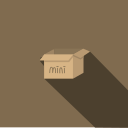

안녕하세요 👋

## 👨‍💻 내가 할 수 있는 것

### 언어

### 프로그램

## 🔨 내가 만든 것
- 미니봇
- [UserWiki](https://userwiki.xyz)
- [ClickSans](https://play.google.com/store/apps/details?id=com.Minibox.ClickSans)
- [BreakCube](https://play.google.com/store/apps/details?id=com.Minibox.BreakCube)

## 📞 연락
### [Discord](https://discord.com/users/310247242546151434)
### [Email](mailto:minibox724@gmail.com)

## 프로필 사진
> 
>
> Ra_Tang님이 제작!

> 
>
> fxrcha님이 제작!
